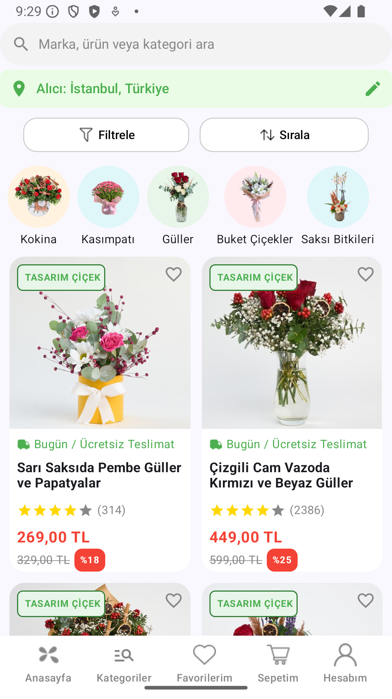

🌺 Çiçek Sepeti UI Clone

Bu proje, Kotlin ve Jetpack Compose kullanılarak geliştirilen Çiçek Sepeti mobil uygulamasının arayüz klonudur. Proje, modern tasarım prensipleri ve Material Design kurallarına uygun olarak geliştirilmiştir. Uygulama, kategori görüntüleme, ürün listeleme, filtreleme ve sıralama gibi temel özellikleri içerir.

  

